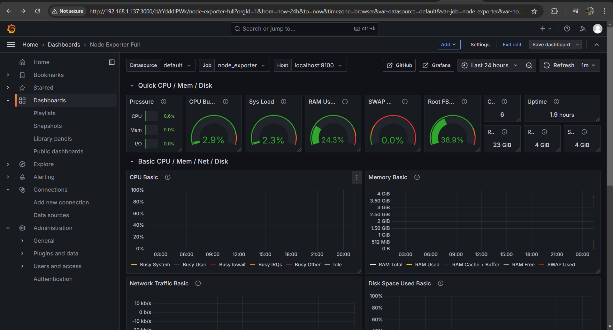

# OS-Server
<p> NIM: 23.83.1006 </p>
<p> Nama: Gabriel Mahesa Surendra</p>

## Spesifikasi OS
Sistem operasi: 24.04 <br>
Minimal 2 CPU dan 4 GB RAM.<br>
Minimal Penyimpanan 50 GB.

### Layanan Server
- Prometheus
- Node Exporter
- MySQL Exporter
- NGINX Exporter
- Redis Exporter
- Apache Exporter
- Grafana
## Install Prometheus
1. Unduh Prometheus
      ```sh
      wget https://github.com/prometheus/prometheus/releases/latest/download/prometheus-2.47.0.linux-amd64.tar.gz
      tar -xvzf prometheus-2.47.0.linux-amd64.tar.gz
      cd prometheus-2.47.0.linux-amd64
      ```
2. Buat Direktori dan Konfigurasi: Pindahkan file Prometheus:
      ```sh
      sudo mv prometheus /usr/local/bin/
      sudo mv promtool /usr/local/bin/
      sudo mkdir /etc/prometheus
      sudo mkdir /var/lib/prometheus
      sudo mv consoles /etc/prometheus/
      sudo mv console_libraries /etc/prometheus/
      sudo mv prometheus.yml /etc/prometheus/
      ```
3. Jalankan Prometheus: Buat file service di /etc/systemd/system/prometheus.service:
    ```sh
   [Unit]
    Description=Prometheus Monitoring
    After=network.target
    
    [Service]
    User=nobody
    ExecStart=/usr/local/bin/prometheus --config.file=/etc/prometheus/prometheus.yml --storage.tsdb.path=/var/lib/prometheus
    
    [Install]
    WantedBy=multi-user.target
   ```
  Reload dan mulai Prometheus:
  ```sh
  sudo systemctl daemon-reload
  sudo systemctl enable --now prometheus
   ```

## Instalasi Node Exporter
1. Unduh dan pasang Node Exporter:
   ```sh
   wget https://github.com/prometheus/node_exporter/releases/latest/download/node_exporter-1.6.0.linux-amd64.tar.gz
   tar -xvzf node_exporter-1.6.0.linux-amd64.tar.gz
   sudo mv node_exporter-1.6.0.linux-amd64/node_exporter /usr/local/bin/
   ```
2. Jalankan sebagai service: Buat file service di /etc/systemd/system/node_exporter.service:
   ```sh
   [Unit]
   Description=Node Exporter
   After=network.target
    
   [Service]
   User=nobody
   ExecStart=/usr/local/bin/node_exporter
    
   [Install]
   WantedBy=multi-user.target
   ```
   Reload dan mulai Node Exporter:
   ```sh
   sudo systemctl daemon-reload
   sudo systemctl enable --now node_exporter
   ```

## Instalasi Layanan Ekspor
1. Instal MySQL Exporter:
   ```sh
   wget https://github.com/prometheus/mysqld_exporter/releases/latest/download/mysqld_exporter-0.14.0.linux-amd64.tar.gz
   tar -xvzf mysqld_exporter-0.14.0.linux-amd64.tar.gz
   sudo mv mysqld_exporter-0.14.0.linux-amd64/mysqld_exporter /usr/local/bin/
   ```
2. Buat user MySQL:
   ```sh
   CREATE USER 'exporter'@'localhost' IDENTIFIED BY 'password';
   GRANT PROCESS, REPLICATION CLIENT, SELECT ON *.* TO 'exporter'@'localhost';
   FLUSH PRIVILEGES;
   ```
3. Jalankan exporter:
   ```sh
   mysqld_exporter --config.my-cnf=/path/to/.my.cnf
   ```

## NGINX Exporter
1. Konfigurasi NGINX: Tambahkan block:
   ```sh
   location /status {
    stub_status;
    allow 192.168.1.137;
    deny all;
   }
   ```
2. Unduh dan jalankan exporter:
   ```sh
   wget https://github.com/nginxinc/nginx-prometheus-exporter/releases/latest/download/nginx-prometheus-exporter-0.11.0.linux-amd64.tar.gz
   tar -xvzf nginx-prometheus-exporter-0.11.0.linux-amd64.tar.gz
   ./nginx-prometheus-exporter -nginx.scrape-uri=http://192.168.1.137/status
   ```
## Redis Exporter
1. Unduh Redis Exporter:
   ```sh
   wget https://github.com/oliver006/redis_exporter/releases/latest/download/redis_exporter-v1.52.0.linux-amd64.tar.gz
   tar -xvzf redis_exporter-v1.52.0.linux-amd64.tar.gz
   sudo mv redis_exporter /usr/local/bin/
   ```
2. Jalankan Redis Exporter:
   ```sh
   redis_exporter --redis.addr=192.168.1.137:6379
   ```

## Apache Exporter
1. Aktifkan mod_status di Apache:
   ```sh
   sudo a2enmod status
   ```
2. Unduh Apache Exporter dan jalankan:
   ```sh
   wget https://github.com/Lusitaniae/apache_exporter/releases/latest/download/apache_exporter-0.11.0.linux-amd64.tar.gz
   tar -xvzf apache_exporter-0.11.0.linux-amd64.tar.gz
   ./apache_exporter -scrape_uri=http://127.0.0.1/server-status?auto
   ```

## Konfigurasi Prometheus
1. Tambahkan konfigurasi berikut di prometheus.yml:
   ```sh
    scrape_configs:
      - job_name: 'node_exporter'
        static_configs:
          - targets: ['localhost:9100']
    
      - job_name: 'mysql_exporter'
        static_configs:
          - targets: ['localhost:9104']
    
      - job_name: 'nginx_exporter'
        static_configs:
          - targets: ['localhost:9113']
    
      - job_name: 'redis_exporter'
        static_configs:
          - targets: ['localhost:9121']
    
      - job_name: 'apache_exporter'
        static_configs:
          - targets: ['localhost:9117']
   ```
2. Reload Prometheus:
   ```sh
   sudo systemctl restart prometheus
   ```

## Instalasi Grafana
1. Tambahkan repositori Grafana:
   ```sh
    sudo apt install -y software-properties-common
    wget -q -O - https://packages.grafana.com/gpg.key | sudo apt-key add -
    echo "deb https://packages.grafana.com/oss/deb stable main" | sudo tee /etc/apt/sources.list.d/grafana.list
   ```
2. Instal dan jalankan Grafana:
   ```sh
    sudo apt update
    sudo apt install -y grafana
    sudo systemctl enable --now grafana-server
   ```

## Integrasi Visualisasi
Tambahkan Prometheus sebagai data source di Grafana. <br>
Gunakan dashboard template dari Grafana untuk masing-masing layanan:<br>
- Node Exporter: Template ID 1860
- MySQL Exporter: Template ID 7362
- NGINX Exporter: Template ID 9615
- Redis Exporter: Template ID 763
- Apache Exporter: Template ID 3894

## Hasil 
### Visualisasi Monitoring
   

### Kesimpulan
Server monitoring yang menggunakan layanan seperti Prometheus, Node Exporter, MySQL Exporter, NGINX Exporter, Redis Exporter, Apache Exporter, dan Grafana memungkinkan pemantauan kinerja dan kesehatan berbagai komponen server secara efektif. Secara keseluruhan, kombinasi Prometheus, eksportir, dan Grafana memberikan solusi pemantauan yang kuat, fleksibel, dan skalabel untuk mengelola server dan aplikasi dalam berbagai lingkungan produksi, meningkatkan kinerja, dan memastikan operasional yang lebih lancar.
